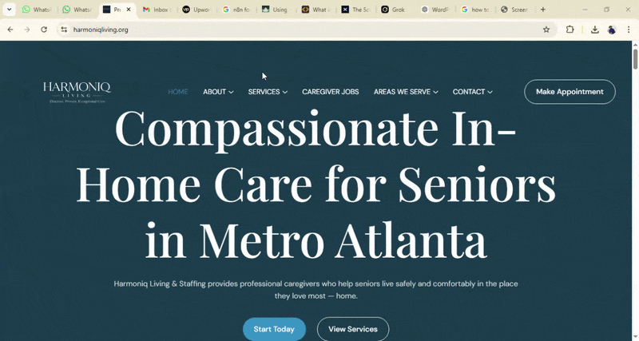

# Harmoniq Living Website

🌐 Live Site: https://harmoniqliving.org

A custom-built WordPress website for a wellness brand, designed to deliver a calm, modern user experience with clean visuals and smooth navigation.

## 💼 My Role
- Frontend development
- WordPress theme customization
- UI/UX improvements

## ⚙️ Features
- Fully responsive design
- Clean and modern UI
- Optimized performance
- User-friendly navigation

## 🛠️ Tech Used
- WordPress (CMS)
- HTML5
- CSS3
- JavaScrip

## 🎬 Creative Work
- Visual layout design
- Graphics and styling

## 🛠️ Tech Used
- WordPress
- HTML
- CSS
- JavaScript

- ## 🧠 Challenges & Solutions
- Ensured consistent design across devices
- Optimized layout for better user experience
- Balanced visuals with performance

- ## 🚀 Future Improvements
- Backend integration for dynamic content
- Performance optimization
- Additional interactive features

## 📸 Screenshots

## 🎥 Live Preview

